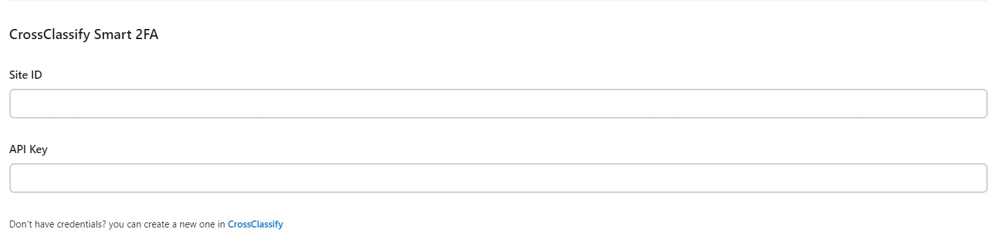
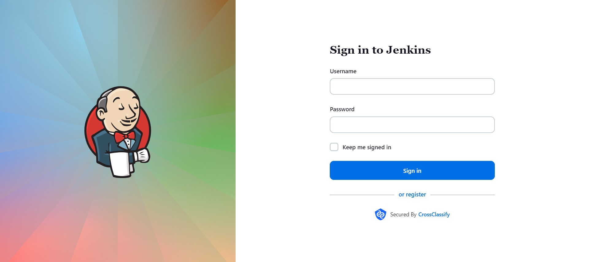

# Smart 2FA Plugin for Jenkins

This plugin allows extending the default login and signup functionalities on Jenkins

## Usage

After installation, its settings are available in: Manage Jenkins » Security » CrossClassify Smart 2FA

Two key are required and controlled from `CrossClassify` application panel:

* API Key
* Site ID

For example

## Result

Plugin installation will render login page like this:

